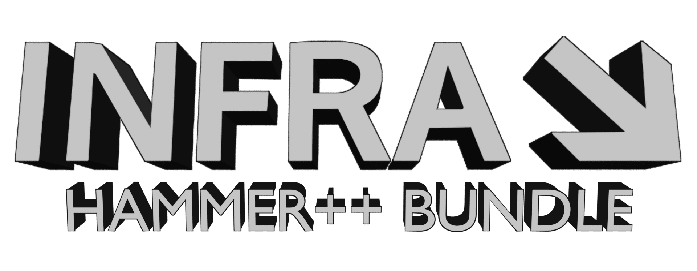

1. [About](#About)
2. [Installation](#Installation)
3. [Other](#Other)
4. [Credits](#Credits)

TODO: Compiling

### About
This small bundle contains minimal required CSGO's Shaders & Libs to run Ficool2's Hammer++

### Installation
1. Extract archive
2. Run setup.bat
3. Insert path to Infra game root folder ( ex. `$steamapps/common/infra` )
4. Run start.bat

### Other
Why did I provide shaders and libs here?\
— As Valve's CSGO is a *free-to-play* game since 2018, anyone can download it and get these files.
But let's be honest, no one is going to download `40 GB` of an old game in order to get a couple of
*shaders* and *platform-specific libs*.

You found shader-specifics glitches, or Hammer++ just crushed\
— Neither **I** nor **Jakub** know what happened to it. Okay, Hammer++ for CSGO is not supported
anymore, and I just removed some CSGO's related *libs* and *shaders*, and test how it's runs, but
I don't know how Hammer++ will behave in the battlefield. Best that you can do, it's open an Issue
or do something by yourself. ( ex. get original `shader vpk`/`libs` form CSGO and place it inside
this bundle. *If u really doing that, don't forget to rename vpk from platform_shaders_* to pak01* )

Why the bundle size is so large?\
— CSGO's Shaders.

And remember the most important thing\
— *THE BUNDLE IS PROVIDED "AS IS", WITHOUT WARRANTY OF ANY KIND!*

### Credits
- Valve - CSGO
- Loiste Interactive - Infra ❤
- Moon-6 Team - GameDir Linker
- Ficool2 - Hammer++ ❤
