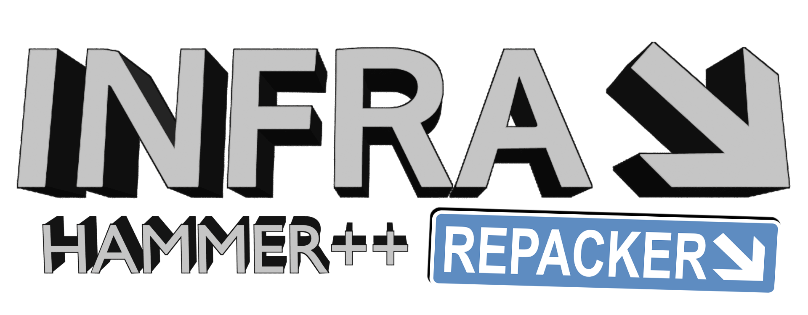

1. [About](#About)
2. [Installation](#Installation)
3. [Other](#Other)
4. [Credits](#Credits)

### About
This repacker will prepare an env to run Ficool2's Hammer++ with INFRA

### Installation
1. Install `Counter-Strike 2` and set beta branch to the `csgo_legacy`
2. [Download latest version](https://github.com/Michael-Soyka/ExINFRA-HammerPlusPlus/releases/latest) of the script
3. Extract archive
4. Run setup.bat
5. Insert path to CSGO game root folder ( ex. `$steamapps/common/Counter-Strike Global Offensive` ) 
4. Insert path to INFRA game root folder ( ex. `$steamapps/common/infra` )
5. Run start.bat

### Support
 - [x] Windows NT
 - [ ] Linux

### Other
— *THE REPACEKR IS PROVIDED "AS IS", WITHOUT WARRANTY OF ANY KIND!*

### Credits
- [Valve](https://github.com/valvesoftware) - CSGO
- Loiste Interactive - Infra ❤
- Moon-6 Team - GameDir Linker
- [Ficool2](https://github.com/ficool2) - Hammer++ ❤
- [Craftablescience](https://github.com/craftablescience) - VPKEdit ❤
